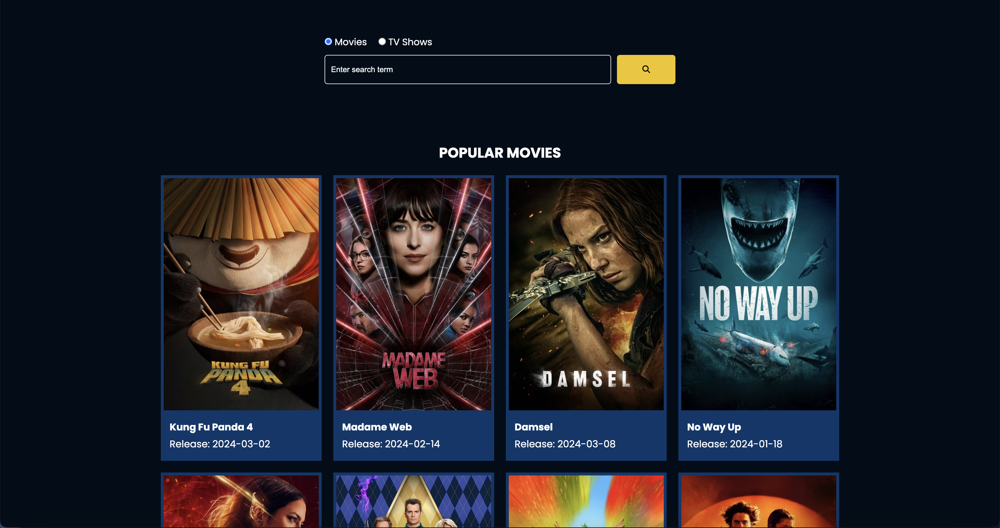

# Flixx App

Flixx App is a web application that showcases popular movies and TV shows, allowing users to explore detailed information about them. It is built with HTML, CSS, and JavaScript, and utilizes the TMDB API v3 for data retrieval.

## Features

- Display popular movies and TV shows
- Detailed pages for movies and TV shows
- Search functionality with pagination support
- Slider showcasing currently playing movies in theaters using the Swiper library

## Technologies Used

- HTML
- CSS
- JavaScript
- TMDB API v3
- Swiper library

## Usage

- Explore popular movies and TV shows
- Use the search bar to find specific movies or TV shows
- Click on a movie or TV show to view detailed information

## Screenshots

## Deployment

This project is deployed on Netlify. You can access it [here](https://flixxmoviesandshows.netlify.app/).